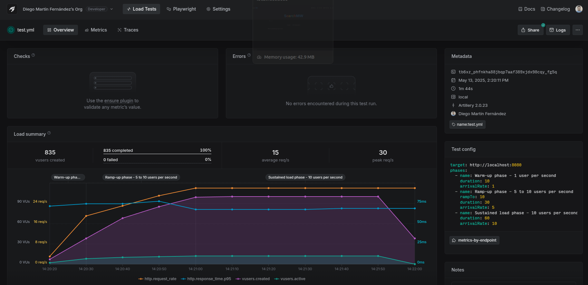

# Search Service Load Testing with Artillery

This project contains performance tests for the Search Service API using Artillery.io, a powerful load testing toolkit.

## Prerequisites

- Node.js (v14 or later)
- npm or yarn
- Running search service API at `http://localhost:8080`

## Installation

Install Artillery globally:

```bash
npm install -g artillery
```

Or use it without installation:

```bash
npx artillery
```

## Running the Tests

Execute the test scenario defined in `test.yml`:

```bash
npx artillery run test.yml -o report.json
```

This will:
1. Register multiple test users
2. Perform search queries with authentication
3. Check search history
4. Generate a JSON report in `report.json`

## Generating HTML Report

Convert the JSON report to a visual HTML report:

```bash
npx artillery report report.json
```

This will create `report.html` with detailed visualizations of the test results.

## Test Configuration

The test simulates three phases:
- Warm-up: 1 user/second for 10 seconds
- Ramp-up: 5-10 users/second for 30 seconds
- Sustained load: 10 users/second for 60 seconds

## Previous Test Results

View the previous test report at:
https://app.artillery.io/share/sh_5b64f961e0edd03151f2edeafead3e8944a9978dca9c3011804e3311d45f43e6



## Customizing Tests

Edit `test.yml` to modify:
- Target URL
- User registration details
- Search queries
- Test duration and load
- Performance thresholds